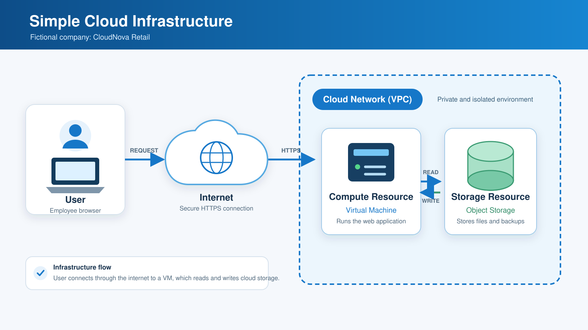

# Laboratory 02: Build the Cloud Infrastructure Blueprint

## Mission Overview

This laboratory activity focused on investigating the major components of cloud infrastructure using an Ubuntu Linux cloud server provided by the KillerCoda Playground. It also involved documenting the relationship among compute, storage, networking, and operating system resources and comparing the core services of AWS, Microsoft Azure, and Google Cloud Platform.

## Objectives

- Explain the major components of cloud infrastructure.
- Investigate the hardware and software resources available in a Linux environment.
- Differentiate compute, storage, networking, and identity resources.
- Interpret the relationship among cloud infrastructure components.
- Compare equivalent services from AWS, Microsoft Azure, and Google Cloud Platform.
- Create professional technical documentation using Markdown.
- Continue building a structured GitHub Cloud Computing Portfolio.

## Cloud Infrastructure Components

| Component | Observation from KillerCoda |
|---|---|
| Compute | One virtual CPU core using an Intel Xeon E312xx processor |
| Storage | A 20 GB virtual disk with a 19 GB main partition |
| Networking | An active `enp1s0` interface using the primary IP address 172.30.1.2 |
| Operating System | Ubuntu 24.04.4 LTS with Linux kernel 6.8.0-138-generic |

Detailed explanations are available in [cloud-components.md](cloud-components.md).

## Tools Used

- KillerCoda Ubuntu Linux Playground
- Linux command-line terminal
- GitHub
- Markdown
- Google Chrome
- Windows Snipping Tool
- Official AWS, Microsoft Azure, and Google Cloud documentation
- AI assistant for guidance, organization, and grammar review

## Linux Commands Executed

| Command | Purpose |
|---|---|
| `grep PRETTY_NAME /etc/os-release` | Display the Linux operating system |
| `uname -r` | Display the kernel version |
| `lscpu` | Display CPU information |
| `nproc` | Display the number of CPU cores |
| `free -h` | Display total and available memory |
| `hostname` | Display the server hostname |
| `hostname -I` | Display the assigned IP addresses |
| `ip -brief address` | Display network interfaces and addresses |
| `lsblk -o NAME,SIZE,TYPE,FSTYPE,MOUNTPOINTS` | Display disk devices and partitions |
| `df -hT` | Display disk capacity and mounted file systems |

## Cloud Architecture

The diagram below shows a user connecting through the internet to a virtual machine inside a cloud network. The virtual machine communicates with an object-storage resource to read and write data.

## Skills Learned

- Using Linux commands to inspect a cloud server
- Identifying compute, storage, networking, and operating system resources
- Reading and interpreting terminal output
- Comparing the services of major cloud providers
- Creating a simple cloud infrastructure diagram
- Writing organized technical documentation using Markdown
- Managing files, screenshots, and commits in GitHub

## Challenges Encountered

One challenge was understanding the different Linux commands and interpreting their results. I addressed this by running commands with clear labels and recording the output in organized tables. Another challenge was organizing the required files and screenshots in GitHub, which I solved by following a consistent folder structure and using meaningful commit messages.

## Laboratory Files

- [Cloud Infrastructure Assessment Report](infrastructure-report.md)
- [Cloud Infrastructure Components](cloud-components.md)
- [Cloud Provider Comparison](cloud-provider-comparison.md)
- [Mission Reflection](reflection.md)
- [Screenshots and Evidence](screenshots)

## Evidence

- [Server Information](screenshots/server-information.png)
- [Network Information](screenshots/network-information.png)
- [Storage Information](screenshots/storage-information.png)
- [Cloud Architecture Diagram](screenshots/cloud-architecture.png)
