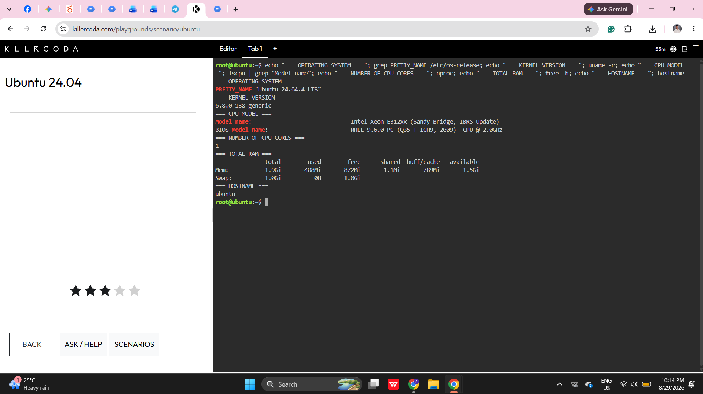
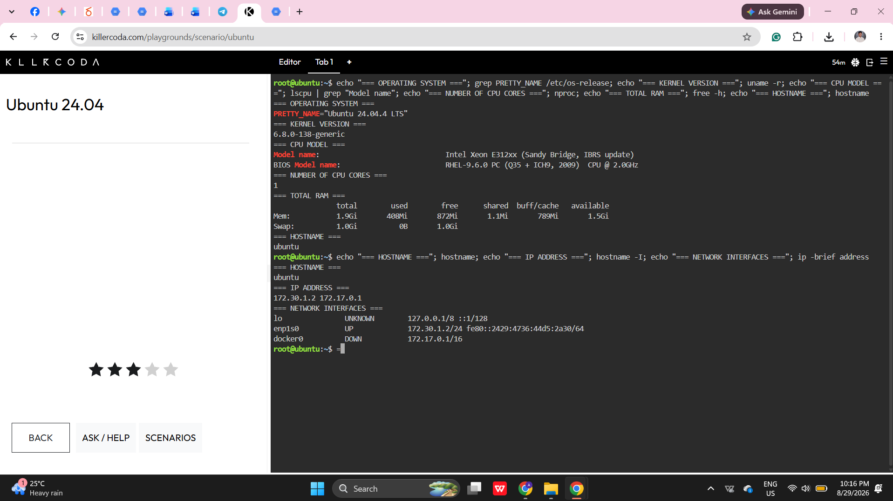
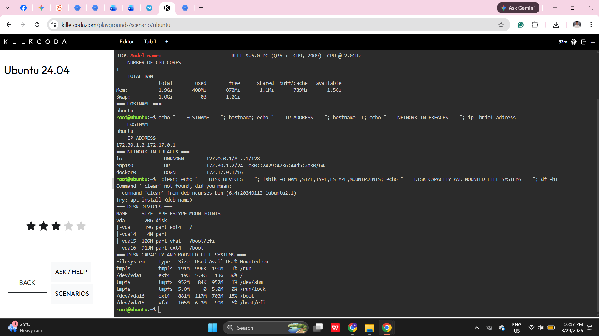

# Cloud Infrastructure Assessment Report

## Linux Server Information

The following information was collected from the Ubuntu Linux cloud server provided by the KillerCoda Playground.

| Infrastructure Detail | Linux Command | Finding |
|---|---|---|
| Operating System | `grep PRETTY_NAME /etc/os-release` | Ubuntu 24.04.4 LTS |
| Kernel Version | `uname -r` | 6.8.0-138-generic |
| CPU Model | `lscpu` | Intel Xeon E312xx (Sandy Bridge, IBRS update) |
| Number of CPU Cores | `nproc` | 1 CPU core |
| Total RAM | `free -h` | 1.9 GiB |
| Disk Capacity | `lsblk` and `df -hT` | 20 GB virtual disk, with a 19 GB main partition and 13 GB available |
| Mounted File Systems | `df -hT` | `/`, `/boot`, `/boot/efi`, `/run`, `/dev/shm`, and `/run/lock` |
| Hostname | `hostname` | ubuntu |
| IP Address | `hostname -I` | 172.30.1.2 primary IP and 172.17.0.1 Docker bridge IP |

## Mounted File Systems

| File System | Type | Capacity | Mount Point |
|---|---|---|---|
| tmpfs | tmpfs | 191 MB | `/run` |
| `/dev/vda1` | ext4 | 19 GB | `/` |
| tmpfs | tmpfs | 952 MB | `/dev/shm` |
| tmpfs | tmpfs | 5 MB | `/run/lock` |
| `/dev/vda16` | ext4 | 881 MB | `/boot` |
| `/dev/vda15` | vfat | 105 MB | `/boot/efi` |

## Assessment Summary

The KillerCoda environment runs Ubuntu 24.04.4 LTS with one virtual CPU core, 1.9 GiB of RAM, and a 20 GB virtual disk. Its primary network interface uses the IP address 172.30.1.2, while Docker provides a separate bridge network using 172.17.0.1. These resources demonstrate how compute, storage, networking, and operating system components work together in a Linux cloud server.

## Evidence

### Server Information

### Network Information

### Storage Information

