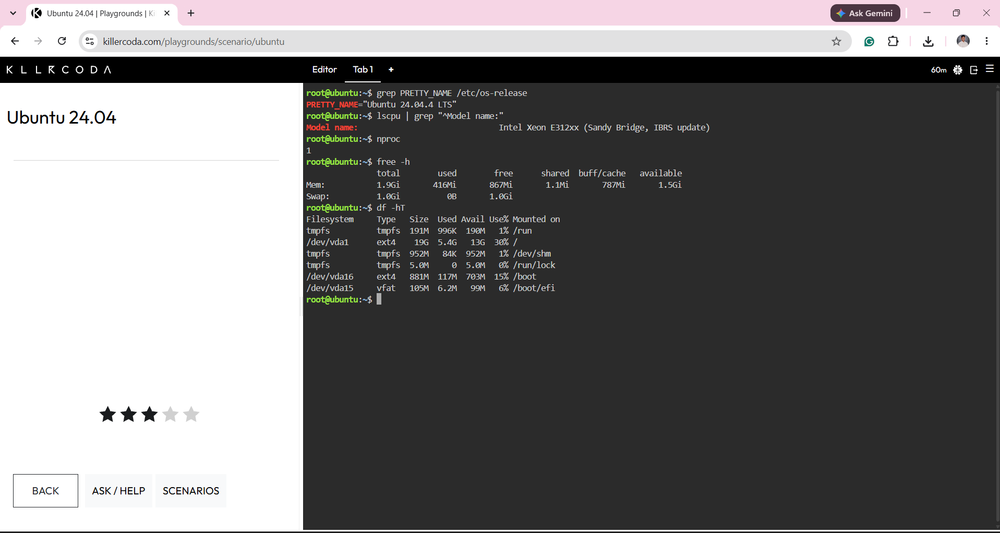

## Linux Server Investigation

The Linux server environment was investigated using the KillerCoda Ubuntu Playground. The following system information was collected using Linux terminal commands.

| System Information | Finding |
|---|---|
| Operating System | Ubuntu 24.04.4 LTS |
| CPU Model | Intel Xeon E312xx (Sandy Bridge, IBRS update) |
| Number of CPU Cores | 1 CPU core |
| Total RAM | 1.9 GiB |
| Main File System | ext4 |
| Main Partition | `/dev/vda1` with 19 GB capacity |
| Used Storage | 5.4 GB |
| Available Storage | 13 GB |

### Equivalent Cloud Virtual-Machine Services

This Ubuntu Linux server can be hosted using the following equivalent cloud services:

- **AWS:** Amazon Elastic Compute Cloud (EC2)
- **Microsoft Azure:** Azure Virtual Machines
- **Google Cloud:** Google Compute Engine

All three services can provide virtual machines capable of running an Ubuntu Linux operating system. The appropriate service would depend on the organization's budget, existing technologies, preferred cloud provider, and application requirements.

### Screenshot Evidence

