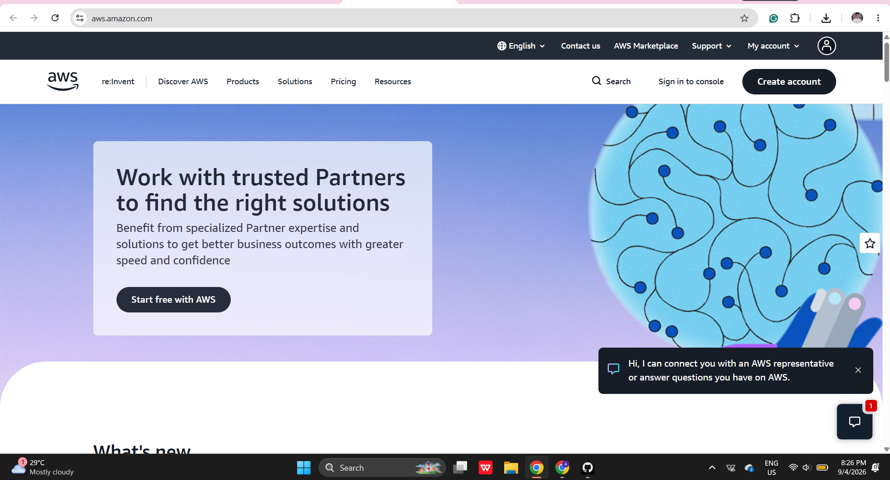

# Amazon Web Services (AWS) Research

## Brief Overview

Amazon Web Services (AWS) is a cloud computing platform provided by Amazon. It offers on-demand services for computing, storage, databases, networking, security, analytics, artificial intelligence, and application development. Organizations can use these resources without purchasing and maintaining their own physical data centers.

## Global Infrastructure

AWS organizes its global infrastructure into geographic Regions and Availability Zones. A Region is a separate geographic area, while an Availability Zone consists of one or more isolated data centers within a Region. Deploying resources across multiple Availability Zones helps organizations improve availability, reliability, and disaster recovery.

AWS also provides Local Zones, Wavelength Zones, and edge locations to place services closer to users and reduce network latency.

## Cloud Management Console

The AWS Management Console is a web-based interface used to access and manage AWS services. Through the console, users can create virtual machines, configure networks, manage storage, control permissions, and monitor cloud resources.

The console includes service search, recently visited services, favorites, and customizable widgets for cost, usage, and service health. AWS resources can also be managed through the AWS Command Line Interface, software development kits, and application programming interfaces.

## Four Core Services

| Category | AWS Service | Purpose |
|---|---|---|
| Compute | Amazon Elastic Compute Cloud (EC2) | Provides scalable virtual servers for running applications and workloads. |
| Storage | Amazon Simple Storage Service (S3) | Stores files and other data as objects inside cloud storage buckets. |
| Networking | Amazon Virtual Private Cloud (VPC) | Creates a logically isolated virtual network for AWS resources. |
| Identity | AWS Identity and Access Management (IAM) | Controls user authentication, permissions, and access to AWS resources. |

## Three Advantages

1. **Broad service selection:** AWS provides services for computing, storage, networking, databases, security, analytics, artificial intelligence, and many other business needs.
2. **Global and reliable infrastructure:** AWS Regions and Availability Zones allow organizations to deploy applications near their users and design highly available systems.
3. **Scalability and flexible pricing:** Organizations can increase or decrease resources based on demand and pay only for the services they use.

## Typical Enterprise Use Cases

- Hosting websites, mobile applications, and business systems
- Storing files, backups, archives, and application data
- Running databases, analytics platforms, and artificial intelligence workloads
- Creating development and testing environments
- Supporting disaster recovery and business continuity
- Delivering applications to users in different parts of the world

## Screenshot Evidence

## Official References

- [What is AWS?](https://aws.amazon.com/what-is-aws/)
- [AWS Global Infrastructure](https://aws.amazon.com/about-aws/global-infrastructure/)
- [AWS Management Console Documentation](https://docs.aws.amazon.com/awsconsolehelpdocs/)
- [Amazon EC2 Documentation](https://docs.aws.amazon.com/AWSEC2/latest/UserGuide/concepts.html)
- [Amazon S3 Documentation](https://docs.aws.amazon.com/AmazonS3/latest/userguide/Welcome.html)
- [Amazon VPC Documentation](https://docs.aws.amazon.com/vpc/latest/userguide/what-is-amazon-vpc.html)
- [AWS IAM Documentation](https://docs.aws.amazon.com/IAM/latest/UserGuide/introduction.html)
