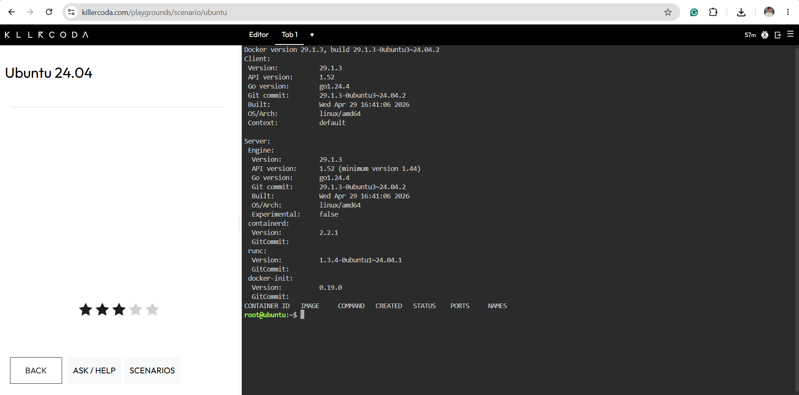
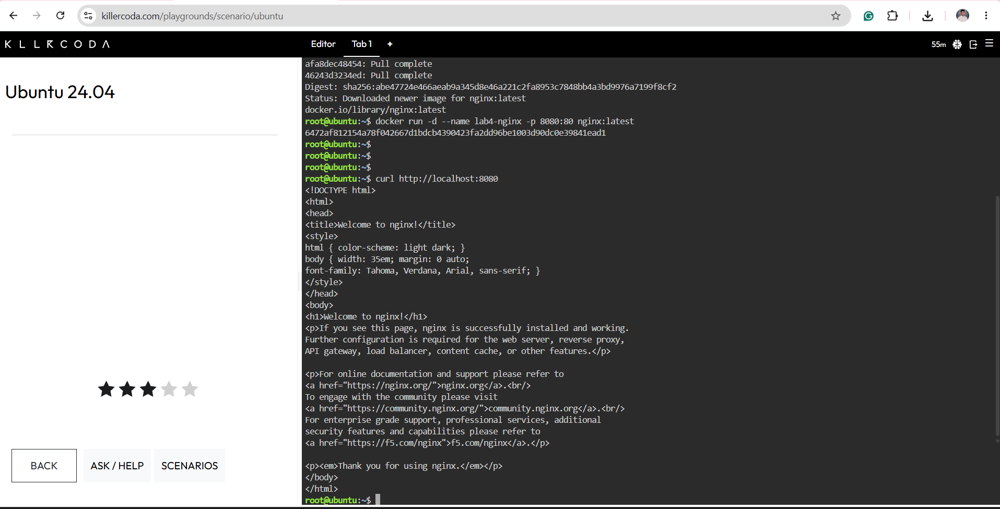
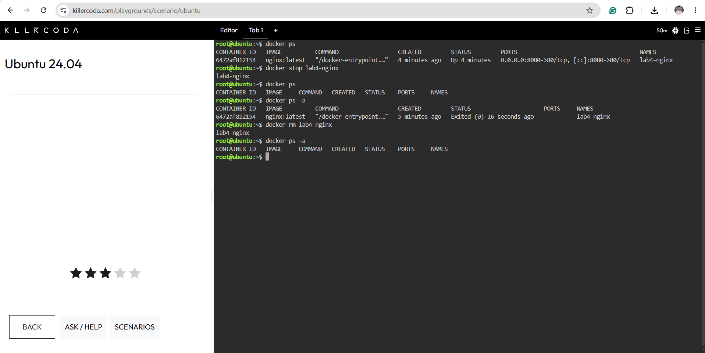

# Docker Deployment and Container Lifecycle

## Environment Verification

| Command | Explanation |
|---|---|
| `docker --version` | Displayed the installed Docker CLI version. |
| `docker version` | Displayed Docker client and server version information. |
| `docker info` | Displayed Docker environment and daemon information. |
| `docker ps` | Listed running containers; initially, the list was empty. |

## Nginx Deployment

| Command | Explanation |
|---|---|
| `docker pull nginx:latest` | Downloaded the official Nginx image. |
| `docker run -d --name lab4-nginx -p 8080:80 nginx:latest` | Started lab4-nginx in the background and mapped host port 8080 to container port 80. |
| `curl http://localhost:8080` | Returned the HTML containing “Welcome to nginx!”, confirming that the web server was accessible. |

## Container Lifecycle

| Command | Explanation |
|---|---|
| `docker ps` | Listed lab4-nginx as a running container. |
| `docker stop lab4-nginx` | Stopped the running Nginx container. |
| `docker ps` | Confirmed that no containers were running. |
| `docker ps -a` | Showed lab4-nginx with an Exited (0) status. |
| `docker rm lab4-nginx` | Removed the stopped container. |
| `docker ps -a` | Confirmed that lab4-nginx was no longer listed. |

