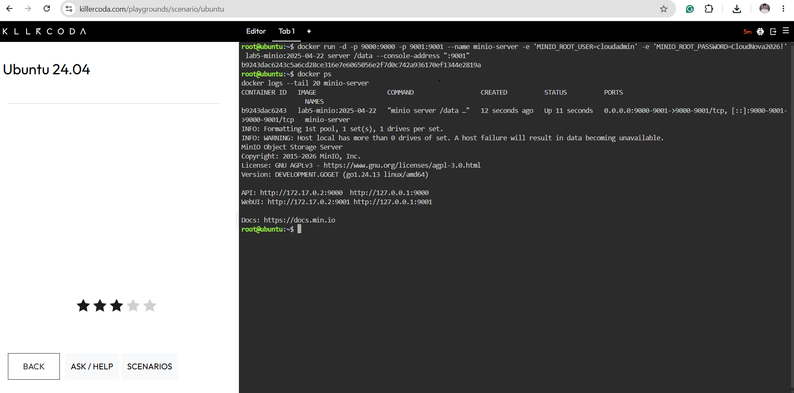
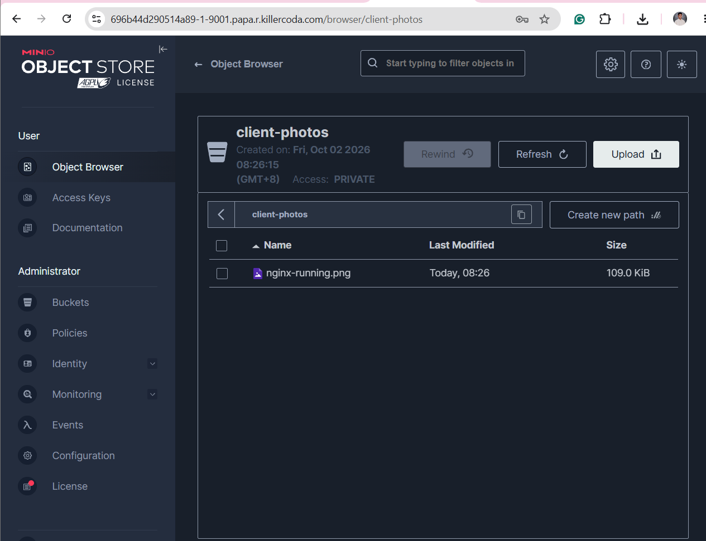

# MinIO Deployment

## Deployment Challenges

Pulling the MinIO images from Docker Hub and Quay returned access errors. To continue the activity, I built a local Docker image from MinIO source code.

## Build the Local Image

I created a Dockerfile with the following contents:

```dockerfile
FROM golang:1.24 AS builder
ENV CGO_ENABLED=0 GOMAXPROCS=1 GOMEMLIMIT=1GiB
RUN go install -p 1 github.com/minio/minio@RELEASE.2025-04-22T22-12-26Z

FROM debian:bookworm-slim
COPY --from=builder /go/bin/minio /usr/local/bin/minio
ENTRYPOINT ["minio"]
```

From the directory containing the Dockerfile, I ran:

```bash
docker build -t lab5-minio:2025-04-22 .
```

## Docker Deployment Command

```bash
docker run -d -p 9000:9000 -p 9001:9001 --name minio-server -e 'MINIO_ROOT_USER=cloudadmin' -e 'MINIO_ROOT_PASSWORD=CloudNova2026!' lab5-minio:2025-04-22 server /data --console-address ":9001"
```

The credentials above were supplied for this temporary laboratory activity.

## Container Verification

```bash
docker ps
docker logs --tail 20 minio-server
```

The container appeared with an Up status, and its logs displayed the API and WebUI addresses.



## Web Console Access

I used KillerCoda's port-access interface to open port 9001 and log in to the MinIO console.

| Port | Purpose |
|---|---|
| 9000 | S3-compatible API |
| 9001 | MinIO Web Console |

## Bucket and Uploaded Object

- Bucket name: `client-photos`
- Access policy: Private
- Uploaded object: `nginx-running.png`

The uploaded file appeared in the bucket's Object Browser.



## Environment Variables

The `-e` flags passed environment variables into the container.

| Variable | Purpose |
|---|---|
| `MINIO_ROOT_USER` | Set the root administrator username. |
| `MINIO_ROOT_PASSWORD` | Set the root administrator password. |

## Storage Limitation

This deployment stored data inside the container without a persistent volume. Removing the container or losing the temporary playground environment would lose this lab data.

## Source

MinIO source repository: https://github.com/minio/minio
