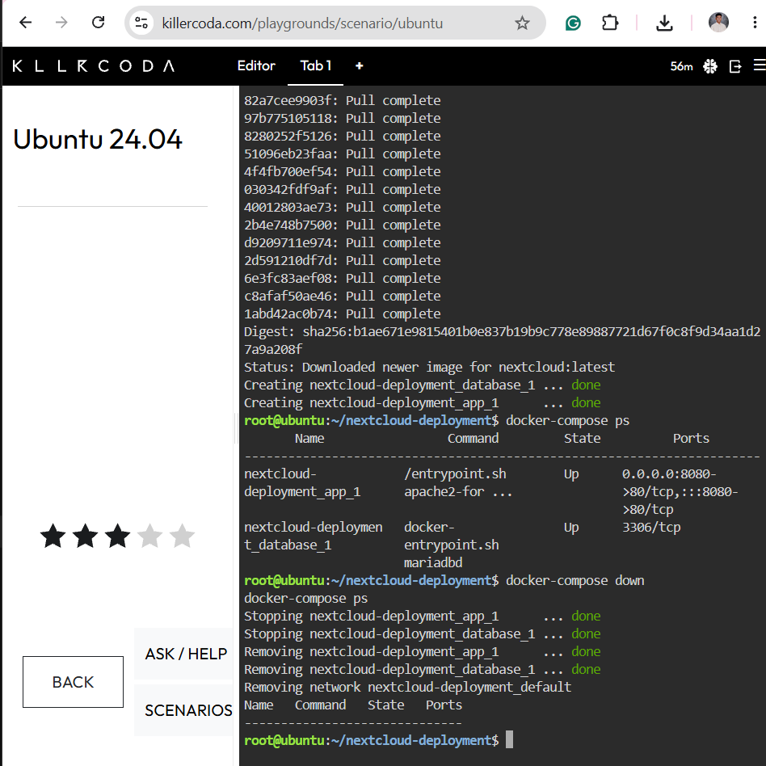
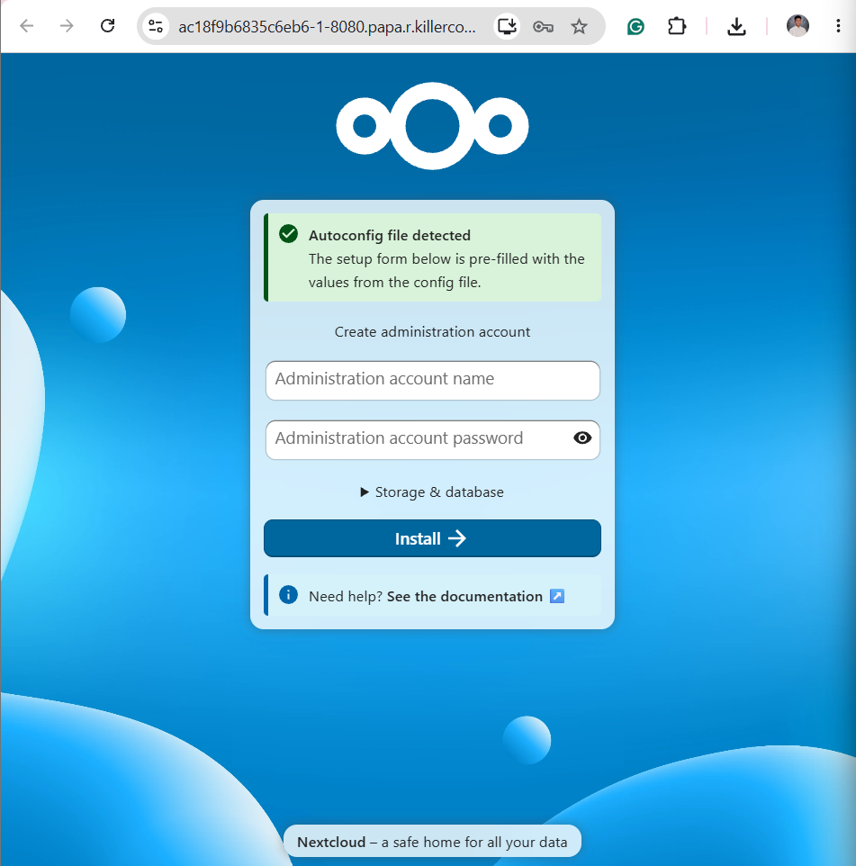
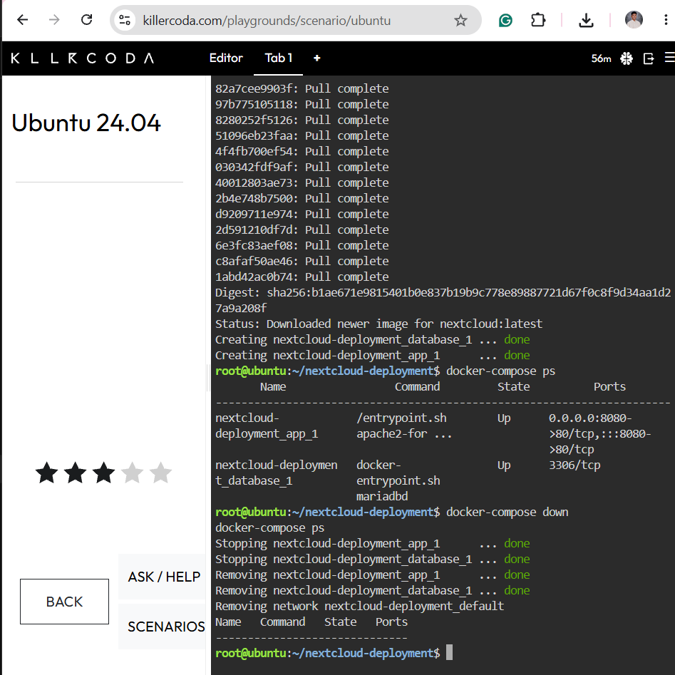

# Laboratory 06 – The Cloud Deployment Engineer

## Mission Overview

This laboratory demonstrates a two-tier deployment using Nextcloud as the application service and MariaDB as the database service. I used Docker Compose in KillerCoda Ubuntu 24.04 to define, start, inspect, and remove the deployment.

Both containers reached the `Up` state, and the Nextcloud setup page was accessible through port 8080. Administrator account creation and full Nextcloud installation were not completed.

## Objectives

- Explain the roles of the application and database tiers.
- Create a YAML configuration for multiple services.
- Configure database settings through environment variables.
- Deploy and inspect containers using Docker Compose.
- Access the Nextcloud setup page.
- Stop and remove the deployment.

## Tools Used

- KillerCoda Ubuntu 24.04
- Docker
- Docker Compose 1.29.2
- Nano
- Nextcloud
- MariaDB 10.6
- GitHub

## Commands Executed

### Create and edit the configuration

```bash
mkdir -p ~/nextcloud-deployment
cd ~/nextcloud-deployment
nano docker-compose.yml
```

### Validate and deploy

```bash
docker-compose --version
docker-compose config
docker-compose up -d
docker-compose ps
```

### Tear down

```bash
docker-compose down
docker-compose ps
```

After a temporary session reset, I recreated the project folder and configuration before repeating the deployment and completing the teardown.

## Skills Learned

- Defining application and database services in YAML.
- Using spaces and consistent indentation in configuration files.
- Passing database configuration through environment variables.
- Using a Compose service name as the database hostname.
- Mapping a host port to a container port.
- Checking container status and troubleshooting directory errors.
- Managing multiple services with Docker Compose.

## Documentation

- [Multi-Tier Architecture](multi-tier-architecture.md)
- [Docker Compose Deployment Guide](docker-compose-guide.md)
- [Reflection](reflection.md)

## Screenshot Evidence

### Running Containers



### Nextcloud Setup Page



### Deployment Teardown



## AI Assistance Disclosure

ChatGPT assisted with command guidance, troubleshooting, and documentation drafts. I executed the laboratory commands and captured the screenshots. AI-assisted text should be reviewed and revised to match my understanding before submission.
